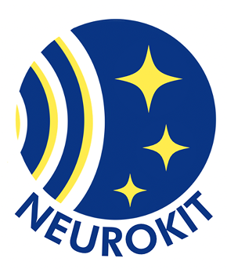

<div align="center">
  
  
  # 🧠 NeuroKit
  
  ### *Smart Study Companion with AI-Powered Motivation*
  
  [](https://flutter.dev)
  [](https://dart.dev)
  [](LICENSE)
  [](https://flutter.dev)
  
  *Revolutionizing how Indonesian students approach focused learning through AI-driven motivation and comprehensive progress tracking.*
  
  [📱 Download](#installation) • [✨ Features](#features) • [🚀 Quick Start](#getting-started) • [📖 Documentation](#documentation) • [👥 Team](#team-neurokit)

</div>

---

## 🌟 **What is NeuroKit?**

NeuroKit is an innovative Flutter application designed specifically for Indonesian students (Kelas 10-12) who want to maximize their learning potential. By combining **AI-powered motivation**, **Bluetooth LE integration**, and **comprehensive progress tracking**, NeuroKit transforms the traditional study experience into an engaging, data-driven journey toward academic success.

> 🎯 **Mission**: To help Indonesian students achieve their dream university admission through smart, focused study sessions powered by artificial intelligence.

---

## ✨ **Features**

### 🤖 **AI-Powered Motivation System**
- **OpenRouter AI Integration**: Personalized motivational messages tailored to your goals
- **ElevenLabs Text-to-Speech**: High-quality voice narration in Indonesian
- **Smart Context Awareness**: Motivation adapts to your university and major aspirations
- **Streaming Text Effects**: Engaging word-by-word display synchronized with audio

### 📊 **Comprehensive Analytics**
- **Study Streak Tracking**: Monitor consecutive days of focused learning
- **Time Analytics**: Detailed breakdown of study sessions and focus time
- **Progress Visualization**: Beautiful charts and statistics
- **Achievement System**: Gamified learning with levels and badges

### 🔗 **Bluetooth LE Integration**
- **Real-time Device Connectivity**: Seamless integration with study hardware
- **Session Monitoring**: Automatic tracking of study sessions
- **Hardware Synchronization**: Enhanced focus measurement capabilities

### 🎨 **Modern User Experience**
- **Beautiful Material Design**: Clean, intuitive interface following modern design principles
- **Dark/Light Theme Support**: Comfortable viewing in any lighting condition
- **Responsive Layout**: Optimized for various screen sizes
- **Smooth Animations**: Engaging transitions and micro-interactions

### ⚙️ **Advanced Settings & Management**
- **Profile Customization**: Name, class (10-12), dream university, and major
- **Data Export**: Export your study statistics in JSON format
- **Privacy Controls**: Complete data management and reset options
- **Offline Capability**: Core features work without internet connection

---

## 🚀 **Getting Started**

### **Prerequisites**

Before you begin, ensure you have the following installed:

- **Flutter SDK** (3.24.0 or higher) - [Install Guide](https://docs.flutter.dev/get-started/install)
- **Dart SDK** (3.5.0 or higher)
- **Android Studio** or **VS Code** with Flutter extensions
- **Git** for version control

### **Installation**

1. **Clone the repository**
   ```bash
   git clone https://github.com/Idoo0/neurokit.git
   cd neurokit
   ```

2. **Install dependencies**
   ```bash
   flutter pub get
   ```

3. **Set up API keys** (Required for AI features)
   ```bash
   # Create your API keys at:
   # OpenRouter: https://openrouter.ai/
   # ElevenLabs: https://elevenlabs.io/
   
   # Add them to lib/utils/constants.dart
   ```

4. **Run the application**
   ```bash
   flutter run
   ```

### **Quick Setup Guide**

1. **First Launch**: Complete the onboarding flow with your personal information
2. **Connect Device**: Enable Bluetooth and pair your study hardware (optional)
3. **Set Goals**: Configure your dream university and major
4. **Start Studying**: Choose your study mode and begin your focused session!

---

## 📱 **Screenshots**

<div align="center">
  
  
  
  
</div>

---

## 🏗️ **Architecture**

NeuroKit is built with a clean, scalable architecture:

```
lib/
├── 📱 view/                 # UI Screens & Widgets
├── 🎮 controllers/          # Business Logic Controllers  
├── 🔧 services/            # Data Services & APIs
├── 📦 models/              # Data Models & Entities
├── 🛣️ routes/              # Navigation & Routing
├── 🧩 components/          # Reusable UI Components
├── 🎨 widgets/             # Custom Widgets
└── ⚡ utils/               # Utilities & Constants
```

### **Key Technologies**

- **State Management**: GetX for reactive state management
- **HTTP Client**: Dio for robust API communications
- **Audio Playback**: AudioPlayers + Flutter TTS for voice features
- **Local Storage**: SharedPreferences for data persistence
- **Bluetooth**: Flutter Blue Plus for LE device connectivity
- **UI Framework**: Material Design 3 with custom theming

---

## 🔧 **Configuration**

### **Environment Setup**

1. **API Configuration** (`lib/utils/constants.dart`):
   ```dart
   class ApiConstants {
     static const String openRouterApiKey = 'your-openrouter-key';
     static const String elevenLabsApiKey = 'your-elevenlabs-key';
     static const String preferredModel = 'meta-llama/llama-3.1-8b-instruct:free';
   }
   ```

2. **Bluetooth Permissions** (Already configured):
   ```xml
   <!-- Android permissions in android/app/src/main/AndroidManifest.xml -->
   <uses-permission android:name="android.permission.BLUETOOTH" />
   <uses-permission android:name="android.permission.BLUETOOTH_ADMIN" />
   <uses-permission android:name="android.permission.ACCESS_COARSE_LOCATION" />
   ```

### **Build Configurations**

- **Debug**: `flutter run`
- **Release**: `flutter build apk --release`
- **Profile**: `flutter run --profile`

---

## 🧪 **Testing**

Run the test suite to ensure everything works correctly:

```bash
# Unit tests
flutter test

# Widget tests
flutter test test/widget_test.dart

# Integration tests (if available)
flutter test integration_test/
```

---

## 📚 **Documentation**

### **API Documentation**

- [OpenRouter Integration Guide](docs/openrouter-setup.md)
- [ElevenLabs TTS Configuration](docs/elevenlabs-setup.md)
- [Bluetooth LE Device Protocol](docs/bluetooth-integration.md)

### **User Guides**

- [Student Onboarding Guide](docs/user-onboarding.md)
- [Study Session Best Practices](docs/study-tips.md)
- [Troubleshooting Common Issues](docs/troubleshooting.md)

### **Developer Resources**

- [Architecture Decision Records](docs/adr/)
- [Code Style Guidelines](docs/code-style.md)
- [Development Environment Setup](docs/dev-setup.md)

---

## 🗺️ **Roadmap**

### **🚀 Current Version (v1.0.0)**
- ✅ AI-powered motivation system
- ✅ Comprehensive study analytics
- ✅ Bluetooth LE integration
- ✅ Modern UI/UX design

### **🔮 Upcoming Features (v1.1.0)**
- [ ] **Social Features**: Study groups and peer comparison
- [ ] **Advanced Analytics**: ML-powered study insights
- [ ] **Pomodoro Integration**: Built-in focus techniques
- [ ] **Cloud Sync**: Cross-device data synchronization

### **🌟 Future Vision (v2.0.0)**
- [ ] **AR Study Assistant**: Augmented reality study tools
- [ ] **Voice Commands**: Hands-free app control
- [ ] **Teacher Dashboard**: Educator insights and reporting
- [ ] **Multi-language Support**: English, Mandarin, and more

---

## 👥 **Team NeuroKit**

NeuroKit is developed and maintained exclusively by the **NeuroKit Team**. This is a **closed-source project** created specifically for Indonesian students to achieve their academic goals.

### **🔒 Private Development**
- This project is **not open for external contributions**
- All development is handled internally by our dedicated team
- Feature requests and bug reports are managed through our official channels

### **📜 Usage License**
- ✅ **Personal Use**: Feel free to use NeuroKit for your studies
- ✅ **Educational Purpose**: Schools and educators may use with permission
- ❌ **Commercial Use**: Not permitted without explicit authorization
- ❌ **Redistribution**: Source code redistribution is not allowed

### **🛠️ About Our Team**
We are a passionate group of Indonesian developers and educators dedicated to transforming the learning experience for students across Indonesia. Our team combines expertise in:

- **Mobile Development**: Flutter & cross-platform solutions
- **AI Integration**: OpenRouter & ElevenLabs implementation
- **Educational Psychology**: Learning optimization strategies
- **User Experience**: Student-centered design principles

---

## 📄 **License & Usage**

### **Proprietary Software**
NeuroKit is proprietary software owned and developed by the NeuroKit Team. All rights reserved.

### **Usage Terms**
- ✅ **Educational Use**: Students may use NeuroKit for personal study purposes
- ✅ **Academic Institutions**: Schools may deploy with proper licensing
- ⚠️ **Commercial Use**: Requires explicit written permission from NeuroKit Team
- ❌ **Source Code**: Not available for redistribution or modification

**For licensing inquiries, contact**: legal@neurokit.dev

---

## 🙏 **Acknowledgments**

- **OpenRouter AI** - For providing accessible AI language models
- **ElevenLabs** - For high-quality text-to-speech capabilities  
- **Flutter Team** - For the amazing cross-platform framework
- **Indonesian Education System** - For inspiring this project
- **Open Source Community** - For the incredible tools and libraries

---

## 📞 **Support & Contact**

### **Official Support Channels**

- 📧 **Email Support**: support@neurokit.dev
- 💬 **Official Discord**: [NeuroKit Community](https://discord.gg/neurokit)
- � **Telegram**: [@neurokitofficial](https://t.me/neurokitofficial)
- 🌐 **Website**: [www.neurokit.dev](https://www.neurokit.dev)

### **For Business Inquiries**

- 💼 **Partnership**: business@neurokit.dev
- 🏫 **Educational Licensing**: schools@neurokit.dev
- ⚖️ **Legal**: legal@neurokit.dev
- 📰 **Media**: media@neurokit.dev

### **User Resources**

- 📚 **User Manual**: [Complete guide for students](https://docs.neurokit.dev/user-guide)
- 🎥 **Video Tutorials**: [YouTube Channel](https://youtube.com/@neurokitapp)
- ❓ **FAQ**: [Frequently Asked Questions](https://help.neurokit.dev/faq)
- � **Troubleshooting**: [Common issues and solutions](https://help.neurokit.dev/troubleshooting)

---

<div align="center">
  
  ### 💝 **Made with Love for Indonesian Students**
  
  *NeuroKit is proudly developed by our dedicated team to help Indonesian students achieve their academic dreams.*
  
  **[📱 Download APK](releases/latest)** • **[📧 Contact Us](#support--contact)** • **[� User Guide](docs/user-guide.md)**
  
  ---
  
  <sub>Built with 🧠 by the NeuroKit Team • © 2024 NeuroKit - All Rights Reserved</sub>

</div>
